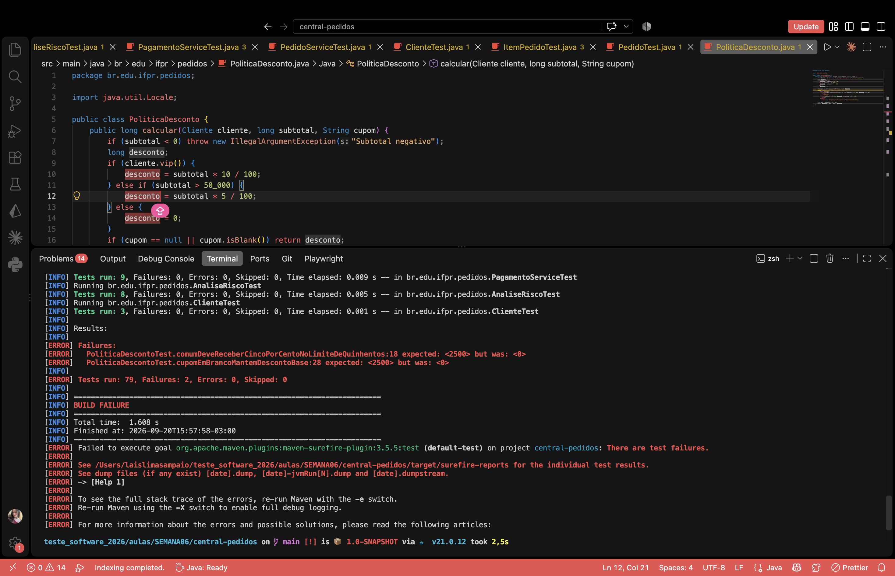
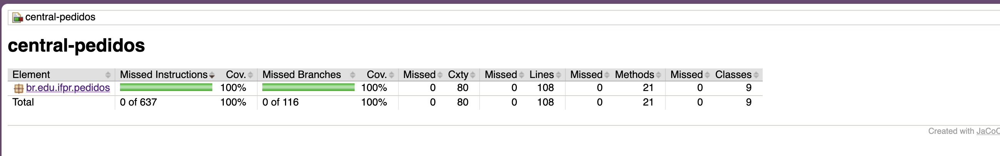
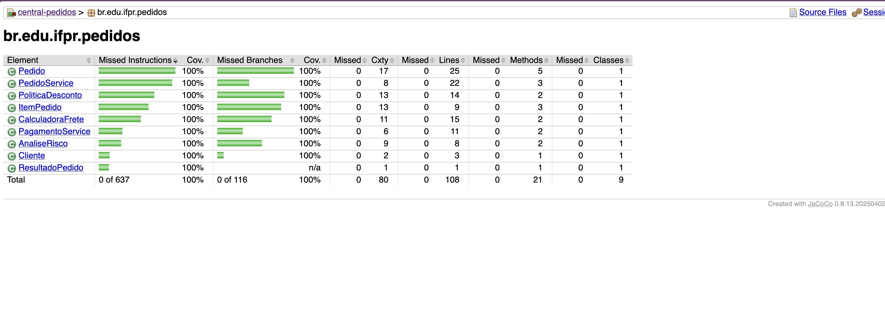
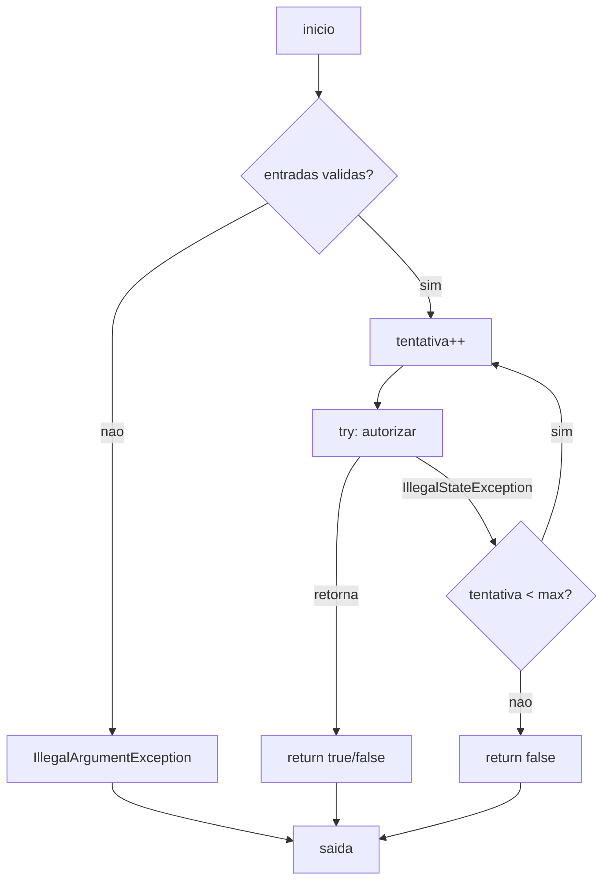

# Relatório do grupo

Integrantes: Lais Lima Sampaio / Emerson Alexandre Tieppo Junior

## Grafos e complexidade

**Modelo adotado.** Cada operando de expressão de curto-circuito (`&&`, `||`) foi
representado como nó de decisão independente, acompanhando o critério de contagem do
JaCoCo. Os múltiplos `return` e `throw` de cada método foram unificados em um nó
terminal único, condição necessária para aplicar V(G) = E − N + 2 sobre um grafo
conectado. A aresta do bloco `try` para o `catch` em `PagamentoService.pagar` foi
modelada como bifurcação real de fluxo, o que produz V(G) = 6 contra os 5 reportados
pelo JaCoCo, que não contabiliza tratamento de exceção como branch. No `switch` sobre
`String` de `CalculadoraFrete.calcular`, contamos as três alternativas de tarifa no
nível do código-fonte, e não a expansão em `hashCode` + `equals` gerada pelo compilador.

O grafo de chamadas a partir de `PedidoService.fechar` é:

fechar → Pedido.subtotalCentavos → ItemPedido.totalCentavos
       → Pedido.estoqueSuficiente → ItemPedido.disponivel
       → PoliticaDesconto.calcular
       → CalculadoraFrete.calcular → Pedido.pesoGramas, Pedido.temFragil
       → AnaliseRisco.avaliar
       → PagamentoService.pagar → ProcessadorPagamento.autorizar (stub)

| Método | Nós | Arestas | V(G) | Caminhos independentes | Restrições de viabilidade |
| --- | --- | --- | --- | --- | --- |
| `PoliticaDesconto.calcular` | 24 | 34 | 12 | 12 | Nenhuma |
| `CalculadoraFrete.calcular` | 21 | 29 | 10 | 10 | Nenhuma |
| `AnaliseRisco.avaliar` | 14 | 20 | 8 | 8 | Ramo `bloqueado → RECUSADO` inalcançável via `PedidoService.fechar` |
| `PagamentoService.pagar` | 13 | 17 | 6 (5 no JaCoCo) | 6 | Aresta `try → catch` não contabilizada como branch pelo JaCoCo |
| `PedidoService.fechar` | 16 | 20 | 6 | 6 | Nenhuma |
| `Pedido` (construtor) | 11 | 14 | 5 | 5 | Nenhuma |
| `Pedido.subtotalCentavos` | 8 | 9 | 3 | 3 | Nenhuma |
| `Pedido.pesoGramas` | 6 | 6 | 2 | 2 | Nenhuma |
| `Pedido.temFragil` | 10 | 12 | 4 | 4 | Nenhuma |
| `Pedido.estoqueSuficiente` | 8 | 9 | 3 | 3 | Nenhuma |
| `ItemPedido` (construtor) | 22 | 31 | 11 | 11 | Nenhuma |
| `Cliente` (construtor) | 5 | 5 | 2 | 2 | Nenhuma |

Os valores de V(G) coincidem com a coluna `Cxty` do JaCoCo em todos os métodos, com a
única exceção documentada de `PagamentoService.pagar`.

## Matriz de testes

| ID / método JUnit | Unidade | Entrada e estado do stub | Resultado esperado | Caminho / aresta | Critério atendido |
| --- | --- | --- | --- | --- | --- |
| `vipDeveReceberDezPorCento` | PoliticaDesconto | VIP, 100.000, cupom null | 10.000 | ramo VIP | decisão verdadeira |
| `comumDeveReceberCincoPorCentoNoLimiteDeQuinhentos` | PoliticaDesconto | comum, 50.000, null | 2.500 | VIP falso, subtotal ≥ limiar | limite exato |
| `comumAbaixoDoLimiteNaoRecebeDesconto` | PoliticaDesconto | comum, 49.999, null | 0 | ambas as decisões falsas | limite − 1 |
| `cupomEmBrancoMantemDescontoBase` | PoliticaDesconto | comum, 50.000, "   " | 2.500 | retorno antecipado por cupom branco | curto-circuito `\|\|` |
| `bemvindoDeveSomarVinteReaisComTrimEMinuscula` | PoliticaDesconto | novo, 10.000, " bemvindo " | 2.000 | case BEMVINDO elegível | normalização trim/upper |
| `bemvindoNaoSeAplicaComComprasAnteriores` | PoliticaDesconto | 1 compra, 10.000, BEMVINDO | 0 | `&&` falha no operando esquerdo | curto-circuito |
| `bemvindoNaoSeAplicaAbaixoDeCemReais` | PoliticaDesconto | novo, 9.900, BEMVINDO | 0 | `&&` falha no operando direito | curto-circuito |
| `extra10DeveSomarDezPorCentoNoLimiteDeDuzentos` | PoliticaDesconto | comum, 20.000, EXTRA10 | 2.000 | case EXTRA10 elegível | limite exato |
| `extra10NaoSeAplicaAbaixoDoLimite` | PoliticaDesconto | comum, 19.999, EXTRA10 | 0 | case EXTRA10 não elegível | limite − 1 |
| `cupomDesconhecidoDeveLancarExcecao` | PoliticaDesconto | comum, 50.000, "XPTO" | IllegalArgumentException | default do switch | exceção |
| `descontoCombinadoDeveRespeitarTetoDeVintePorCento` | PoliticaDesconto | VIP novo, 10.000, BEMVINDO | 2.000 (seria 3.000) | ramo `desconto > teto` | teto de 20% |
| `subtotalNegativoDeveLancarExcecao` | PoliticaDesconto | −1 | IllegalArgumentException | guarda de entrada | exceção |
| `deveCobrarTarifaDoParana` | CalculadoraFrete | UF PR, 1.000 g, líquido 10.000 | 1.200 | case PR | alternativa do switch |
| `deveCobrarTarifaDeSaoPaulo` | CalculadoraFrete | UF SP | 2.000 | case SP | alternativa do switch |
| `deveCobrarTarifaDoRioDeJaneiro` | CalculadoraFrete | UF RJ | 2.000 | fall-through SP→RJ | alternativa do switch |
| `deveCobrarTarifaPadraoParaDemaisEstados` | CalculadoraFrete | UF MG | 3.000 | default | alternativa do switch |
| `naoDeveCobrarAdicionalComPesoExatoDeDoisQuilos` | CalculadoraFrete | 2.000 g | 1.200 | `while` com zero iterações | limite do laço |
| `deveCobrarUmaFracaoAcimaDeDoisQuilos` | CalculadoraFrete | 2.001 g | 1.500 | `while` com uma iteração | uma iteração |
| `deveCobrarTresFracoesComQuatroQuilosEUmGrama` | CalculadoraFrete | 4.001 g | 2.100 | `while` com três iterações | várias iterações |
| `deveZerarFreteComValorLiquidoAcimaDeTrezentosEEntregaNormal` | CalculadoraFrete | líquido 30.000, normal | 0 | `&&` verdadeiro | gratuidade |
| `naoDeveZerarFreteQuandoEntregaEExpressa` | CalculadoraFrete | líquido 30.000, expresso | 2.700 | `&&` falha no direito | curto-circuito |
| `vipDevePagarMetadeDoFrete` | CalculadoraFrete | VIP, líquido 10.000 | 600 | ramo VIP verdadeiro | decisão independente |
| `adicionalDeFragilIncideMesmoComBaseZerada` | CalculadoraFrete | VIP, líquido 30.000, frágil | 500 | base zerada + adicional | combinação de decisões |
| `adicionalDeFragilDeveSerCobradoUmaUnicaVez` | CalculadoraFrete | dois itens frágeis | 1.700 | `temFragil` com retorno antecipado | idempotência do adicional |
| `itemInativoNaoDeveAtivarAdicionalDeFragil` | CalculadoraFrete | frágil com quantidade 0 | 1.200 | `&&` falha no esquerdo | linha inativa |
| `valorLiquidoNegativoDeveLancarExcecao` | CalculadoraFrete | líquido −1 | IllegalArgumentException | guarda de entrada | exceção |
| `clienteBloqueadoDeveSerRecusado` | AnaliseRisco | bloqueado, total 0 | "RECUSADO" | retorno antecipado | ramo inviável no serviço |
| `clienteNovoComTotalAltoVaiParaRevisao` | AnaliseRisco | novo, 100.001 | "REVISAO" | `\|\|` verdadeiro no esquerdo | limite + 1 |
| `clienteNovoComEntregaExpressaVaiParaRevisao` | AnaliseRisco | novo, 100.000, expresso | "REVISAO" | `\|\|` verdadeiro no direito | curto-circuito |
| `clienteNovoNoLimiteSemExpressoDeveSerAprovado` | AnaliseRisco | novo, 100.000, normal | "APROVADO" | ambos falsos | limite exato |
| `clienteComHistoricoAcimaDeCincoMilVaiParaRevisao` | AnaliseRisco | 1 compra, 500.001, não VIP | "REVISAO" | `&&` verdadeiro | limite + 1 |
| `vipComHistoricoEValorAltoDeveSerAprovado` | AnaliseRisco | 1 compra, 500.001, VIP | "APROVADO" | `&&` falha no direito | curto-circuito |
| `clienteComHistoricoNoLimiteDeveSerAprovado` | AnaliseRisco | 1 compra, 500.000 | "APROVADO" | `&&` falha no esquerdo | limite exato |
| `totalNegativoDeveLancarExcecao` | AnaliseRisco | total −1 | IllegalArgumentException | guarda de entrada | exceção |
| `deveAprovarNaPrimeiraTentativa` | PagamentoService | stub aprova de imediato | true, 1 chamada, valor 11.200 | `do/while` com uma volta | uma iteração |
| `recusaDefinitivaNaoDeveRepetirTentativa` | PagamentoService | stub retorna false | false, 1 chamada | retorno dentro do `try` | recusa ≠ indisponibilidade |
| `deveAprovarNaTerceiraTentativaAposDuasIndisponibilidades` | PagamentoService | 2 exceções e depois true | true, 3 chamadas | `catch` seguido de nova volta | várias iterações |
| `deveRecusarAoEsgotarAsTresTentativas` | PagamentoService | stub sempre indisponível | false, 3 chamadas | saída do laço por limite | esgotamento |
| `deveRecusarComUmaUnicaTentativaPermitida` | PagamentoService | indisponível, maxTentativas 1 | false, 1 chamada | limite inferior do laço | limite |
| `outrasExcecoesDevemPropagar` | PagamentoService | stub lança RuntimeException | RuntimeException propagada | exceção não capturada | exceção fora do `catch` |
| `totalNaoPositivoDeveLancarExcecao` | PagamentoService | total 0 | IllegalArgumentException | guarda de entrada | limite |
| `limiteDeTentativasForaDoIntervaloDeveLancarExcecao` | PagamentoService | maxTentativas 0 e 4 | IllegalArgumentException | guarda de entrada | limites do intervalo |
| `processadorNuloDeveLancarNullPointer` | PagamentoService | processador null | NullPointerException | `requireNonNull` | dependência obrigatória |
| `deveFecharPedidoDeClienteComumComFreteDoParanaEPagamentoAprovado` | PedidoService | comum, PR, stub aprova | PAGO, total 11.200, 1 cobrança | caminho completo | colaboração |
| `clienteBloqueadoDeveEncerrarSemCobranca` | PedidoService | bloqueado | BLOQUEADO, zeros, 0 cobranças | retorno antecipado 1 | ordem do contrato |
| `pedidoSemItensAtivosDeveLancarExcecao` | PedidoService | item com quantidade 0 | IllegalArgumentException | subtotal zero | exceção |
| `faltaDeEstoqueDeveEncerrarSemCobranca` | PedidoService | quantidade 2, estoque 1 | SEM_ESTOQUE, zeros, 0 cobranças | retorno antecipado 2 | ordem do contrato |
| `estoqueDeveSerAvaliadoAntesDoCupom` | PedidoService | sem estoque + cupom "XPTO" | SEM_ESTOQUE sem exceção | ordem estoque → cupom | ordem do contrato |
| `clienteNovoComEntregaExpressaDeveFicarEmRevisaoSemCobranca` | PedidoService | novo, SP, expresso | REVISAO, frete 3.500, total 23.500, 0 cobranças | retorno por risco | regra posterior não executada |
| `vipDeveTerDescontoEFreteGratuito` | PedidoService | VIP, PR, 60.000 | PAGO, desconto 6.000, frete 0, total 54.000 | caminho com gratuidade | colaboração |
| `recusaDoProcessadorDevePreservarOsValoresCalculados` | PedidoService | stub recusa | PAGAMENTO_RECUSADO, total 54.000 | ramo de recusa | efeito observável |
| `deveCriarClienteValido` / `deveAceitarHistoricoZerado` / `historicoNegativoDeveLancarExcecao` | Cliente | histórico 5, 0 e −1 | acessores e exceção | guarda do construtor | limites |
| `deveCalcularTotalDaLinha` / `linhaInativaDeveTerTotalZero` | ItemPedido | quantidade 3 e 0 | 30.000 e 0 | aritmética da linha | linha inativa |
| `deveEstarDisponivelQuandoQuantidadeIgualAoEstoque` / `naoDeveEstarDisponivel...` | ItemPedido | 5/5 e 6/5 | true e false | decisão de disponibilidade | limite |
| `skuNuloDeveLancarExcecao` / `skuEmBrancoDeveLancarExcecao` | ItemPedido | null e "   " | IllegalArgumentException | `\|\|` esquerdo e direito | curto-circuito |
| `precoForaDoIntervaloDeveLancarExcecao` / `deveAceitarPrecoNosLimites` | ItemPedido | 0, 1.000.001, 1, 1.000.000 | exceção e aceite | ambos os ramos | limites |
| `quantidadeForaDoIntervaloDeveLancarExcecao` | ItemPedido | −1 e 101 | IllegalArgumentException | ambos os ramos | limites |
| `estoqueNegativoDeveLancarExcecao` | ItemPedido | estoque −1 | IllegalArgumentException | guarda | limite |
| `pesoForaDoIntervaloDeveLancarExcecao` | ItemPedido | 0 e 100.001 | IllegalArgumentException | ambos os ramos | limites |
| `subtotalDeListaVaziaDeveSerZero` / `subtotalDeUmaLinhaAtiva` / `linhaInativaNaoDeveSomar...` | Pedido | 0, 1 e 2 linhas | 0, 20.000 e 20.000 | `for` com 0, 1 e várias voltas | `continue` |
| `deveSomarOPesoDeTodasAsLinhas` | Pedido | duas linhas | 1.300 g | `for` de peso | várias iterações |
| `deveDetectarItemFragilAtivo` / `itemFragilInativoNaoDeveContar` / `pedidoSemItemFragil` | Pedido | frágil ativo, inativo e não frágil | true, false, false | `&&` nos dois lados | curto-circuito |
| `listaVaziaTemEstoqueSuficiente` | Pedido | lista vazia | true | `for` com zero voltas | zero iterações |
| `deveDetectarFaltaDeEstoqueNaPrimeiraLinha` / `...NaUltimaLinha` | Pedido | falta no início e no fim | false | `break` precoce e tardio | posição no laço |
| `deveCopiarAListaDefensivamente` | Pedido | lista mutável limpa depois | itens preservados | `List.copyOf` | efeito observável |
| `listaNulaDeveLancarExcecao` / `listaComMaisDeCemLinhasDeveLancarExcecao` | Pedido | null e 101 linhas | IllegalArgumentException | `\|\|` esquerdo e direito | curto-circuito |
| `ufInvalidaDeveLancarExcecao` | Pedido | null, "P", "pr", "PRR" | IllegalArgumentException | validação de formato | limites do regex |
| `ufDesconhecidaComFormatoValidoDeveSerAceita` | Pedido | "ZZ" | aceita, tarifa padrão | formato válido | classe de equivalência |

## Evolução da cobertura

| Etapa | Testes executados | Linhas | Branches | Métodos | Classes | Lacunas e justificativas |
| --- | --- | --- | --- | --- | --- | --- |
| Inicial | 0 | Não medido | Não medido | Não medido | Não medido | Sem testes |
| Exemplo fornecido | 1 | Parcial | Parcial | Parcial | 9/9 | Um único caminho de fechamento exercitado; todas as classes tocadas, mas a maioria dos ramos descoberta |
| Testes unitários por classe | 72 | 100% | 99% | 100% | 100% | Faltava o ramo `itens.size() > 100` do construtor de `Pedido` |
| Suíte completa | 80 | 100% (108/108) | 100% (116/116) | 100% (21/21) | 100% (9/9) | Nenhuma lacuna; 0 de 637 instruções perdidas |

## Análise crítica

**Quais combinações faltavam mesmo com os ramos cobertos?**
Em `CalculadoraFrete.calcular`, as decisões de gratuidade, VIP, entrega expressa e
fragilidade são independentes entre si. A suíte cobre 100% dos ramos, mas exercita
apenas parte das 16 combinações possíveis dessas quatro condições. O mesmo efeito
aparece de forma didática em `Participacao.calcularPontos` (projeto boletim-simples):
dois testes, `(true,true)` e `(false,false)`, já produzem 100% de cobertura de branches
e deixam duas das quatro combinações de entrada sem nunca serem executadas. Cobertura
de ramos, portanto, não demonstra cobertura de caminhos, e laços multiplicam caminhos
sem alterar a contagem de branches.

**Quais condições não foram avaliadas devido ao curto-circuito?**
Em `PoliticaDesconto`, na condição `comprasAnteriores() == 0 && subtotal >= 10_000`, o
teste com histórico não nulo nunca avalia o operando direito. Em `AnaliseRisco`, na
condição `total > 100_000 || expresso`, quando o total excede o limiar o valor de
`expresso` não chega a ser consultado. Em `Pedido.temFragil`, `quantidade() > 0 &&
fragil()` não avalia a fragilidade de linhas inativas. Escrevemos um teste para cada
lado de cada operador justamente para exercitar as duas situações.

**Quais caminhos são inviáveis no serviço, mas viáveis na unidade?**
O ramo `cliente.bloqueado() → "RECUSADO"` de `AnaliseRisco.avaliar` é coberto em teste
unitário, mas é inalcançável através de `PedidoService.fechar`, porque o serviço retorna
`"BLOQUEADO"` antes de chamar a análise de risco. A cobertura desse ramo vem
exclusivamente do teste de unidade, nunca do teste de colaboração. Não alteramos a
implementação para forçar o caminho.

**Como foram testadas exceções e quantidades de iterações?**
O `try/catch` de `PagamentoService.pagar` não é contabilizado como branch pelo JaCoCo,
razão da divergência entre nosso V(G) = 6 e o `Cxty` = 5 do relatório. Ainda assim foi
testado em três cenários: indisponibilidade seguida de aprovação, esgotamento das
tentativas e propagação de exceção não prevista. As iterações foram exercitadas com
zero, uma e três voltas no `while` do frete (pesos de 2.000 g, 2.001 g e 4.001 g) e com
zero, uma e várias linhas nos `for` de `Pedido`, incluindo falta de estoque na primeira
e na última posição para cobrir o `break` precoce e o tardio.

**Qual alteração proposital foi detectada por qual teste? A alteração foi desfeita?**
Alteramos `subtotal >= 50_000` para `subtotal > 50_000` em `PoliticaDesconto.calcular`.
O teste `comumDeveReceberCincoPorCentoNoLimiteDeQuinhentos` falhou, esperando 2.500 e
obtendo 0, porque exercita o valor exatamente no limiar. Nenhum outro teste acusou a
mudança, o que confirma que apenas o caso de fronteira detecta esse tipo de mutação. A
alteração foi desfeita e a suíte voltou a passar com 80 testes.

### CFG — PagamentoService.pagar

